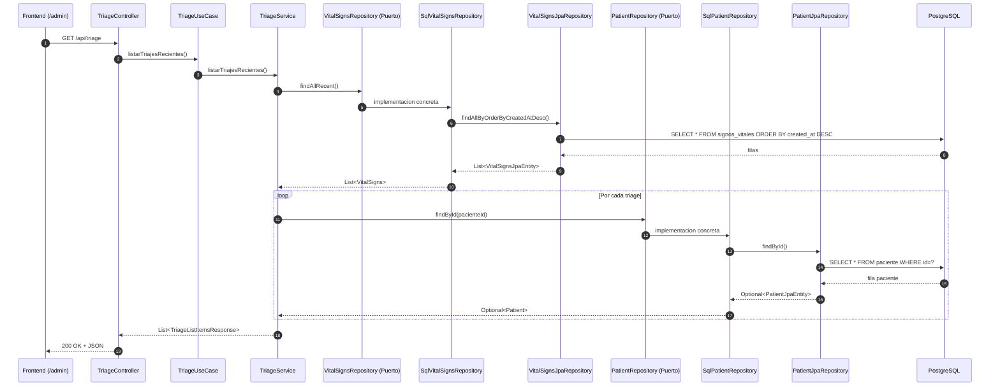
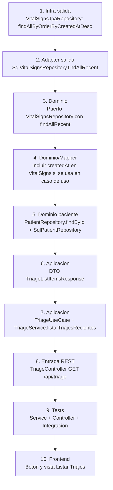

# Diagrama de Procesos - Listar Triages (Arquitectura Hexagonal)

Este documento describe el flujo de implementacion de la funcionalidad **Listar Triages Recientes** orientado a capas y puertos/adaptadores en arquitectura hexagonal.

## 1) Vista por capas (Hexagonal)

```mermaid
flowchart LR
    subgraph Cliente[Cliente]
        UI[Frontend Admin\nBoton: Listar Triajes]
    end

    subgraph AdaptadoresEntrada[Adaptadores de Entrada]
        CTRL[TriageController\nGET /api/triage]
    end

    subgraph Aplicacion[Capa de Aplicacion]
        UC[TriageUseCase\nlistarTriajesRecientes()]
        SVC[TriageService\nOrquesta y mapea DTO]
        DTO[TriageListItemsResponse]
    end

    subgraph Dominio[Capa de Dominio]
        PORT_VS[Puerto: VitalSignsRepository]
        PORT_PT[Puerto: PatientRepository]
        MODEL_VS[Modelo: VitalSigns]
        MODEL_PT[Modelo: Patient]
    end

    subgraph AdaptadoresSalida[Adaptadores de Salida]
        SQL_VS[SqlVitalSignsRepository]
        SQL_PT[SqlPatientRepository]
        MAP[Mapper: VitalSignsMapper]
    end

    subgraph Infra[Infraestructura]
        JPA_VS[VitalSignsJpaRepository\nfindAllByOrderByCreatedAtDesc()]
        JPA_PT[PatientJpaRepository\nfindById()]
        DB[(PostgreSQL)]
    end

    UI --> CTRL
    CTRL --> UC
    UC --> SVC
    SVC --> PORT_VS
    SVC --> PORT_PT

    PORT_VS --> SQL_VS
    PORT_PT --> SQL_PT

    SQL_VS --> JPA_VS --> DB
    SQL_PT --> JPA_PT --> DB

    SQL_VS --> MAP --> MODEL_VS
    SQL_PT --> MODEL_PT
    SVC --> DTO --> CTRL --> UI
```

## 2) Flujo de ejecucion end-to-end



## 3) Proceso de implementacion (orden recomendado)



## 4) Contrato de salida sugerido (JSON)

```json
[
  {
    "signosVitalesId": 25,
    "pacienteId": 11,
    "fechaHoraRegistro": "2026-05-13T14:35:20",
    "nombreCompleto": "Juan Perez",
    "dpi": "1234567890123",
    "prioridad": "ROJO",
    "alertaEmergencia": true,
    "presionSistolica": 80,
    "presionDiastolica": 50,
    "frecuenciaCardiaca": 130,
    "temperatura": 39.2,
    "saturacionOxigeno": 87,
    "pesoKg": 72.5,
    "tallaCm": 168
  }
]
```

## 5) Criterios de aceptacion tecnicos

- El endpoint `GET /api/triage` responde `200 OK` con lista ordenada por `fechaHoraRegistro` descendente.
- La respuesta incluye prioridad y alerta coherentes con signos vitales.
- No rompe el flujo existente de `POST /api/triage`.
- Existen pruebas unitarias de servicio y controlador, mas una prueba de integracion de orden y contenido.
- El frontend puede consumir el contrato sin transformaciones complejas.

