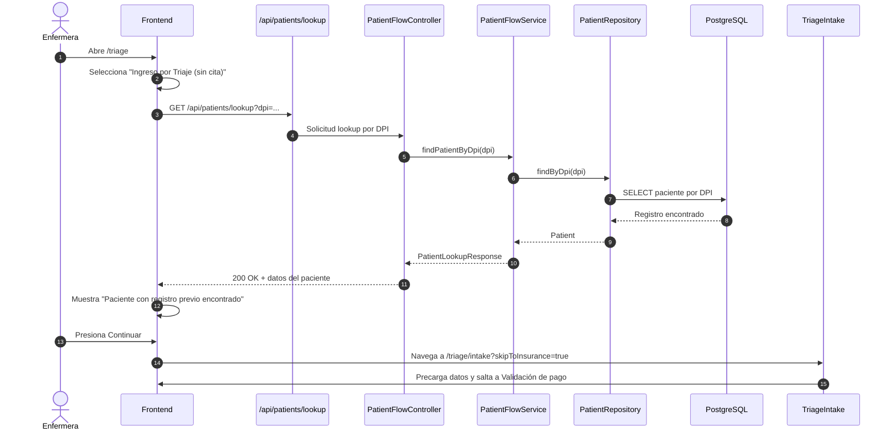
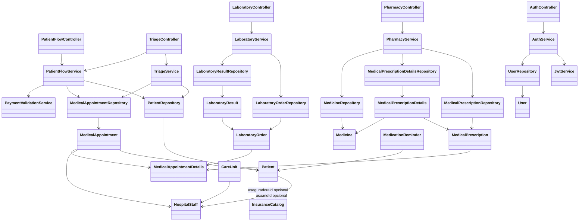
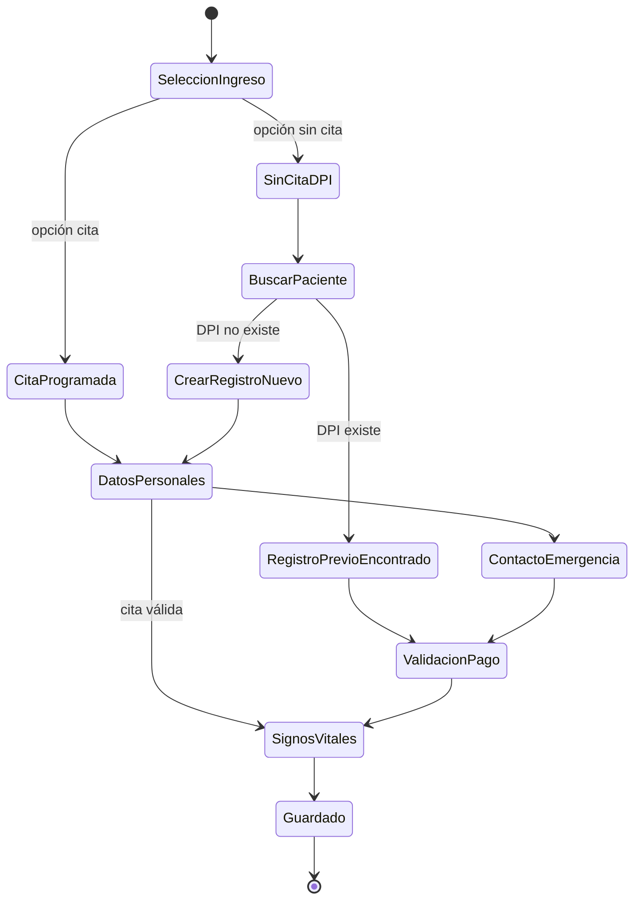
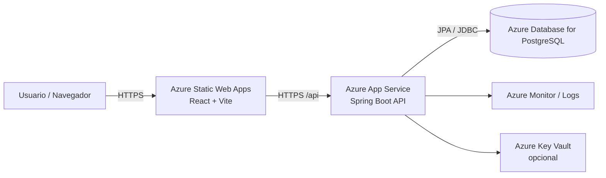

# Sistema HIS — Documentación Técnica y Manual de Usuario

**Repositorio:** `his-backend`  
**Tecnologías principales:** Spring Boot + Spring Security + JPA + PostgreSQL + React + Vite + Tailwind  
**Versión del documento:** 1.0  
**Fecha:** 2026-05-27

---

## Índice

1. [Resumen ejecutivo](#1-resumen-ejecutivo)
2. [Arquitectura general](#2-arquitectura-general)
3. [Estructura de módulos](#3-estructura-de-módulos)
4. [Dependencias y configuración](#4-dependencias-y-configuración)
5. [Modelo funcional y flujos](#5-modelo-funcional-y-flujos)
6. [Manual de usuario](#6-manual-de-usuario)
7. [Manual técnico](#7-manual-técnico)
8. [Diagramas Mermaid](#8-diagramas-mermaid)
9. [Despliegue en Azure](#9-despliegue-en-azure)
10. [Glosario técnico](#10-glosario-técnico)

---

## 1. Resumen ejecutivo

El sistema HIS es una plataforma hospitalaria con dos capas principales:

- **Backend**: API REST en Spring Boot con arquitectura hexagonal.
- **Frontend**: SPA en React/TypeScript con Vite y Tailwind CSS.

La solución cubre los flujos principales de atención hospitalaria:

- Autenticación y control de acceso por roles.
- Portal de paciente.
- Administración de usuarios.
- Gestión de citas.
- Triaje y clasificación de urgencia.
- Flujo de laboratorio.
- Flujo de farmacia.

La arquitectura separa claramente:

- **Adapters**: controladores REST.
- **Application**: servicios, casos de uso y DTOs.
- **Domain**: modelos y puertos.
- **Infrastructure**: persistencia, seguridad y mapeos.

---

## 2. Arquitectura general

### 2.1 Vista de alto nivel

El sistema sigue una arquitectura de tipo **hexagonal / clean architecture** en el backend y una arquitectura de componentes en el frontend.

**Flujo general:**

1. El usuario accede al frontend.
2. El frontend llama a la API REST.
3. El backend autentica con JWT y verifica roles.
4. Los servicios de aplicación ejecutan la lógica de negocio.
5. Los puertos del dominio abstraen la persistencia.
6. Los adaptadores JPA convierten entre dominio y base de datos.
7. PostgreSQL almacena la información.

### 2.2 Tecnologías detectadas

#### Backend
- Spring Boot 4.0.4
- Spring Web MVC
- Spring Data JPA
- Spring Security
- Validation (Bean Validation)
- JJWT 0.11.5
- Springdoc OpenAPI 3.0.2
- PostgreSQL
- H2 para pruebas
- Lombok

#### Frontend
- React 18.2
- React DOM
- React Router DOM 6
- Axios
- Vite 5
- TypeScript 5
- Tailwind CSS 3.4
- Vitest + Testing Library

---

## 3. Estructura de módulos

### 3.1 Estructura del repositorio

```text
his-backend/
├── pom.xml
├── mvnw
├── mvnw.cmd
├── src/
│   ├── main/
│   │   ├── java/
│   │   │   └── his/
│   │   │       ├── adapters/
│   │   │       │   ├── exception/
│   │   │       │   └── rest/
│   │   │       ├── application/
│   │   │       │   ├── dto/
│   │   │       │   ├── services/
│   │   │       │   └── usecases/
│   │   │       ├── config/
│   │   │       ├── domain/
│   │   │       │   ├── models/
│   │   │       │   └── ports/
│   │   │       └── infrastructure/
│   │   │           ├── persistence/
│   │   │           │   ├── adapter/
│   │   │           │   ├── entities/
│   │   │           │   ├── mapper/
│   │   │           │   └── repositories/
│   │   │           └── security/
│   │   └── resources/
│   │       └── application.properties
│   └── test/
│       └── java/
└── frontend/
    ├── package.json
    ├── vite.config.ts
    ├── tsconfig.json
    ├── tailwind.config.ts
    ├── postcss.config.js
    └── src/
        ├── App.tsx
        ├── main.tsx
        ├── components/
        ├── context/
        ├── hooks/
        ├── pages/
        ├── services/
        ├── styles/
        └── test/
```

### 3.2 Tabla de módulos principales

| Módulo | Ubicación | Responsabilidad |
|---|---|---|
| Autenticación | `adapters/rest/AuthController.java`, `application/services/AuthService.java`, `infrastructure/security/*` | Login, registro, JWT, blacklist de tokens |
| Pacientes / Triaje | `PatientFlowController`, `TriageController`, `PatientFlowService`, `TriageService` | Registro de paciente, disponibilidad, triaje, búsqueda de cita pagada |
| Citas | `AppointmentController`, `AppointmentService` | Programación y gestión de citas |
| Laboratorio | `LaboratoryController`, `LaboratoryService` | Órdenes, recepción de muestras, resultados |
| Farmacia | `PharmacyController`, `PharmacyService` | Prescripciones, despacho y recordatorios |
| Catálogos | `CatalogController`, `CatalogService` | Géneros, especialidades, unidades, aseguradoras |
| Usuarios | `UserMaintenanceController`, `UserMaintenanceService` | Administración de usuarios y personal |
| Portal paciente | `frontend/src/pages/UserPortal.tsx` | Vista del paciente autenticado |
| Dashboard admin | `frontend/src/pages/AdminDashboard.tsx` | Panel administrativo |
| Triaje | `frontend/src/pages/TriageConsultationSelection.tsx`, `TriageIntake.tsx` | Ingreso y clasificación |

### 3.3 Estructura del frontend

- `src/App.tsx`: define rutas.
- `src/context/AuthContext.tsx`: estado global de autenticación.
- `src/components/ProtectedRoute.tsx`: protección por rol.
- `src/hooks/useSidebarPreference.ts`: preferencia de sidebar por sesión.
- `src/services/api.ts`: cliente HTTP y tipos compartidos.
- `src/pages/*`: pantallas principales.

### 3.4 Subproyecto adicional

Existe también `frontend/app/`, un scaffold Vite mínimo con:

- `main.ts`
- `counter.ts`
- `style.css`

Este subproyecto parece ser un entorno auxiliar/legado y **no forma parte del flujo principal HIS**.

---

## 4. Dependencias y configuración

### 4.1 Backend (`pom.xml`)

Dependencias principales:

- `spring-boot-starter-data-jpa`
- `spring-boot-starter-validation`
- `spring-boot-starter-webmvc`
- `spring-boot-starter-security`
- `jjwt-api`, `jjwt-impl`, `jjwt-jackson`
- `springdoc-openapi-starter-webmvc-ui`
- `postgresql`
- `spring-boot-starter-test`
- `h2`
- `lombok`

**Java target:** 17  
**Empaquetado:** Spring Boot ejecutable

### 4.2 Frontend (`frontend/package.json`)

Dependencias principales:

- `react`
- `react-dom`
- `react-router-dom`
- `axios`

Dev dependencies principales:

- `vite`
- `typescript`
- `tailwindcss`
- `autoprefixer`
- `postcss`
- `vitest`
- `@testing-library/react`
- `@testing-library/jest-dom`

### 4.3 Configuración del frontend

#### `vite.config.ts`
- Alias `@ -> ./src`
- Puerto de desarrollo: `5173`
- Proxy `/api -> http://localhost:8080`

#### `tsconfig.json`
- Target: `ES2020`
- `strict: true`
- Base URL y alias `@/*`

#### `tailwind.config.ts`
- Escanea `index.html` y `src/**/*.{js,ts,jsx,tsx}`

### 4.4 Configuración del backend

#### `src/main/resources/application.properties`

- Aplicación: `his-backend`
- Perfil activo: `prod`
- Puerto: `8080`
- PostgreSQL local: `jdbc:postgresql://localhost:5432/his`
- Usuario: `postgres`
- Hibernate: `ddl-auto=update`
- Swagger habilitado
- JWT secret y expiración definidos

> Nota: en documentación y despliegue conviene inyectar credenciales por variables de entorno.

---

## 5. Modelo funcional y flujos

### 5.1 Roles del sistema

- `PACIENTE`
- `ADMIN`
- `DOCTOR`
- `ENFERMERA`
- `LABORATORISTA`
- `FARMACEUTICO`
- `ADMINISTRATIVO`
- `RECEPCION`

### 5.2 Flujo de autenticación

1. Usuario abre `/login`.
2. Se elige acceso de paciente o personal.
3. El frontend envía credenciales a `/api/auth/authenticate`.
4. El backend genera JWT.
5. El frontend guarda `token` y `user` en `sessionStorage`.
6. Las rutas protegidas se resguardan con `ProtectedRoute`.
7. Si el rol no coincide, se redirige al dashboard por defecto.

### 5.3 Flujo de triaje

#### Paso 0: Selección de ingreso
Ruta: `/triage`

- Llega con cita programada.
- Ingreso por triaje sin cita.
- Si es sin cita, se busca por DPI.

#### Paso 1: Intakes clínicos
Ruta: `/triage/intake`

- Datos personales.
- Contacto de emergencia.
- Validación de pago.
- Signos vitales.

#### Comportamiento relevante
- Si el paciente existe, el flujo puede precargar datos desde el lookup por DPI.
- Si no existe, se ofrece crear un registro nuevo.
- La validación y persistencia final siguen la lógica de backend.

### 5.4 Flujo de laboratorio

1. Doctor o laboratorista crea orden desde una cita/detalle.
2. Laboratorio recibe la muestra.
3. Se registran resultados.
4. Se consulta el estado de la orden o el resultado.

### 5.5 Flujo de farmacia

1. Doctor crea la receta.
2. Farmacia consulta recetas activas.
3. Se valida stock y solvencia administrativa.
4. Se despacha el medicamento.
5. Se exponen recordatorios activos del paciente.

---

## 6. Manual de usuario

### 6.1 Inicio de sesión

#### Para personal hospitalario
1. Abrir `http://localhost:5173/login`.
2. Seleccionar acceso de personal.
3. Ingresar correo y contraseña.
4. El sistema redirige al dashboard según rol.

#### Para pacientes
1. Abrir `http://localhost:5173/login`.
2. Seleccionar acceso de paciente.
3. Ingresar correo y contraseña.
4. El sistema redirige al portal del paciente.

### 6.2 Uso del dashboard administrativo

Ruta: `/admin`

Desde aquí el personal puede:

- Ir al triaje.
- Gestionar usuarios.
- Ver citas.
- Acceder a módulos clínicos según su rol.

### 6.3 Uso del triaje

Ruta: `/triage`

#### Caso A: Paciente con cita programada
1. Seleccionar **Llega con cita programada**.
2. Continuar al formulario de triaje.
3. Ingresar ID de cita.
4. Buscar cita pagada.
5. Completar signos vitales.
6. Guardar.

#### Caso B: Ingreso por triaje sin cita
1. Seleccionar **Ingreso por Triaje (sin cita)**.
2. Ingresar DPI.
3. Buscar paciente.
4. Si aparece como registrado previamente, presionar **Continuar** para saltar a validación de pago.
5. Si no existe, presionar **Crear registro Nuevo** para ingresar datos personales.
6. Completar la secuencia clínica.
7. Guardar.

### 6.4 Portal del paciente

Ruta: `/portal`

El paciente autenticado puede:

- Ver sus citas.
- Consultar información personal.
- Revisar historial y documentos.
- Entrar a gestión de citas.

### 6.5 Módulo de laboratorio

Ruta administrativa según permisos.

- Crear órdenes.
- Recibir muestras.
- Registrar resultados.
- Consultar órdenes por detalle de cita.

### 6.6 Módulo de farmacia

Ruta administrativa según permisos.

- Ver medicamentos disponibles.
- Crear recetas.
- Despachar medicamentos.
- Consultar recordatorios.

---

## 7. Manual técnico

### 7.1 Backend: arquitectura

El backend está organizado por capas:

#### 1) `adapters/rest`
Controladores REST que exponen la API.

Ejemplos:
- `AuthController`
- `TriageController`
- `PatientFlowController`
- `LaboratoryController`
- `PharmacyController`

#### 2) `application`
Contiene la lógica de negocio y casos de uso.

Ejemplos:
- `AuthService`
- `PatientFlowService`
- `TriageService`
- `LaboratoryService`
- `PharmacyService`
- `PaymentValidationService`

#### 3) `domain`
Modelo de negocio puro y puertos.

- `models`: entidades de dominio.
- `ports`: contratos de persistencia.

#### 4) `infrastructure`
Implementaciones técnicas:

- Persistencia JPA.
- Mappers.
- Seguridad JWT.
- Adaptadores a repositorios.

### 7.2 Backend: controladores principales

#### `AuthController`
- `POST /api/auth/register`
- `POST /api/auth/register/personal`
- `POST /api/auth/register/admin`
- `POST /api/auth/authenticate`
- `POST /api/auth/logout`

#### `TriageController`
- `POST /api/triage`
- `GET /api/triage`
- `GET /api/triage/paid-appointment?dpi=...`
- `GET /api/triage/paid-appointment?citaMedicaId=...`

#### `PatientFlowController`
- `GET /api/patients/availability`
- `GET /api/patients/lookup`
- `POST /api/patients/register`
- `POST /api/patients/triage`
- `GET /api/patients/me`
- `PUT /api/patients/me`

#### `LaboratoryController`
- `POST /api/laboratory/orders`
- `PATCH /api/laboratory/orders/{id}/receive`
- `PATCH /api/laboratory/orders/{id}/reject`
- `POST /api/laboratory/orders/result`
- `GET /api/laboratory/orders/by-detalle/{citaMedicaDetalleId}`
- `GET /api/laboratory/orders/{ordenLaboratorioId}`

#### `PharmacyController`
- `GET /api/pharmacy/medicines`
- `POST /api/pharmacy/prescriptions`
- `GET /api/pharmacy/prescriptions/by-detalle/{citaMedicaDetalleId}`
- `POST /api/pharmacy/dispense`
- `GET /api/pharmacy/reminders/{pacienteId}`

### 7.3 Backend: persistencia

Capas de persistencia:

- `entities`: entidades JPA.
- `repositories`: interfaces Spring Data.
- `adapter`: adaptadores que implementan puertos del dominio.
- `mapper`: conversión entre JPA y dominio.

### 7.4 Backend: seguridad

La seguridad está basada en:

- JWT.
- `SecurityConfig`.
- `JwtFilter`.
- `JwtService`.
- `TokenBlacklistService`.
- Control por rol en los controladores.

### 7.5 Frontend: arquitectura

#### `src/context/AuthContext.tsx`
- Guarda usuario y token.
- Restaura sesión desde `sessionStorage`.
- Expulsa sesión si el JWT expira.

#### `src/components/ProtectedRoute.tsx`
- Bloquea rutas sin sesión.
- Redirige por rol.

#### `src/services/api.ts`
- Configura Axios.
- Interceptor para Authorization.
- Tipos compartidos con el backend.

#### `src/pages/*`
- Pantallas funcionales por flujo.

### 7.6 Entidades y modelos de dominio principales

#### Modelos activamente usados
- `User`
- `HospitalStaff`
- `Patient`
- `MedicalAppointment`
- `MedicalAppointmentDetails`
- `LaboratoryOrder`
- `LaboratoryResult`
- `MedicalPrescription`
- `MedicalPrescriptionDetails`
- `Medicine`
- `MedicationReminder`
- `InsuranceCatalog`
- `CareUnit`
- `MedicalSpecialityCatalog`
- `PaymentOption`
- `Priority`
- `StatusAppointment`
- `LaboratoryOrderStatus`
- `AdministrativeAppointmentStatus`
- `PatientGender`
- `Role`

#### Modelos conservados para laboratorio/farmacia
- `MedicalSample`
- `OrderSample`

---

## 8. Diagramas Mermaid

### 8.1 Diagrama de secuencia

#### Triaje sin cita con búsqueda por DPI y paciente existente



### 8.2 Diagrama de clases



### 8.3 Diagrama de estados

#### Flujo de triaje



### 8.4 Diagrama de despliegue (Azure)



---

## 9. Despliegue en Azure

### 9.1 Opción recomendada

#### Frontend
- **Azure Static Web Apps** o **Azure App Service**.
- Se sirve el build de Vite (`npm run build`).
- Requiere variable `VITE_API_URL` apuntando al backend.

#### Backend
- **Azure App Service** con runtime Java 17.
- Arranque con `java -jar his-backend-0.0.1-SNAPSHOT.jar`.
- Variables recomendadas:
  - `SPRING_PROFILES_ACTIVE=prod`
  - `SPRING_DATASOURCE_URL`
  - `SPRING_DATASOURCE_USERNAME`
  - `SPRING_DATASOURCE_PASSWORD`
  - `JWT_SECRET_KEY`
  - `JWT_EXPIRATION_HOURS`

#### Base de datos
- **Azure Database for PostgreSQL**.
- Tablas creadas por Hibernate con `ddl-auto=update` en entornos controlados.

### 9.2 Flujo de despliegue

1. Compilar backend.
2. Generar build del frontend.
3. Publicar frontend en Azure Static Web Apps.
4. Publicar backend en Azure App Service.
5. Conectar backend a PostgreSQL administrado.
6. Verificar CORS, JWT y rutas protegidas.

### 9.3 Observaciones

- En producción conviene mover secretos a variables o Key Vault.
- No se recomienda exponer credenciales en el repositorio.
- El frontend usa proxy local solo para desarrollo.

---

## 10. Glosario técnico

- **API REST**: interfaz HTTP para intercambio de datos.
- **JWT**: token firmado para autenticación stateless.
- **Hexagonal architecture**: organización por puertos y adaptadores.
- **DTO**: objeto de transferencia de datos.
- **JPA**: capa de persistencia para entidades relacionales.
- **Mapper**: conversión entre capas o modelos.
- **Role-based access control**: control de acceso por rol.
- **Triaje**: clasificación clínica de urgencia.
- **Solvencia administrativa**: validación de pago/documentación.
- **Lookup**: búsqueda de un registro ya existente.
- **Paciente walk-in**: paciente sin cita previa.
- **Catalogo**: conjunto de opciones maestras (géneros, aseguradoras, etc.).
- **SessionStorage**: almacenamiento temporal por sesión del navegador.
- **Proxy Vite**: redirección local de `/api` al backend en desarrollo.
- **App Service**: servicio administrado de Azure para aplicaciones web.
- **Static Web Apps**: hosting administrado para SPAs en Azure.

---

## Cierre

Este documento resume la estructura y funcionamiento del sistema HIS a nivel funcional y técnico, e incluye los diagramas solicitados para integrarse directamente en un repositorio o manual académico.

